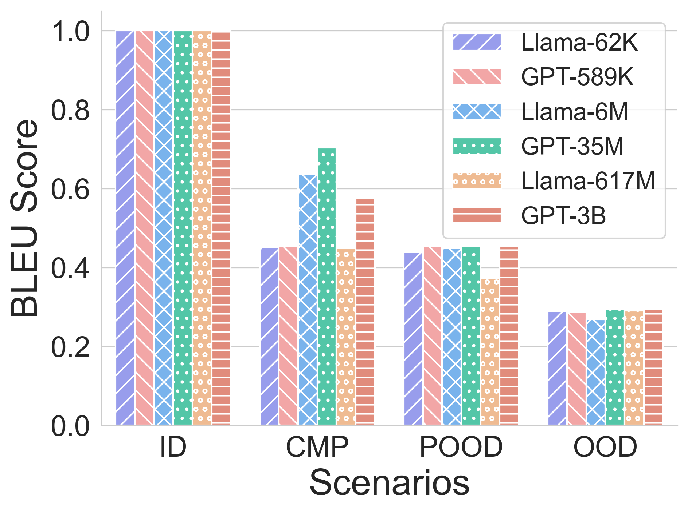
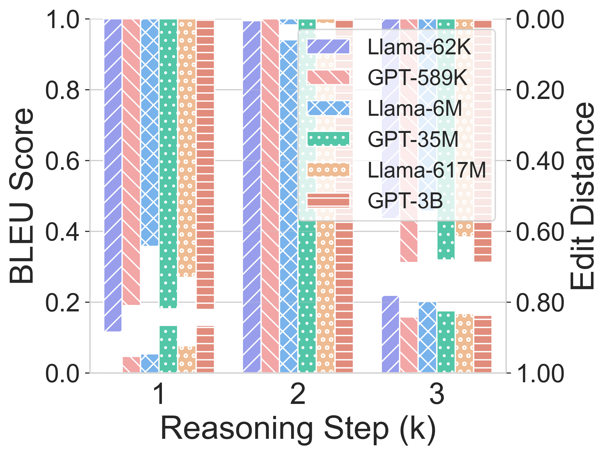
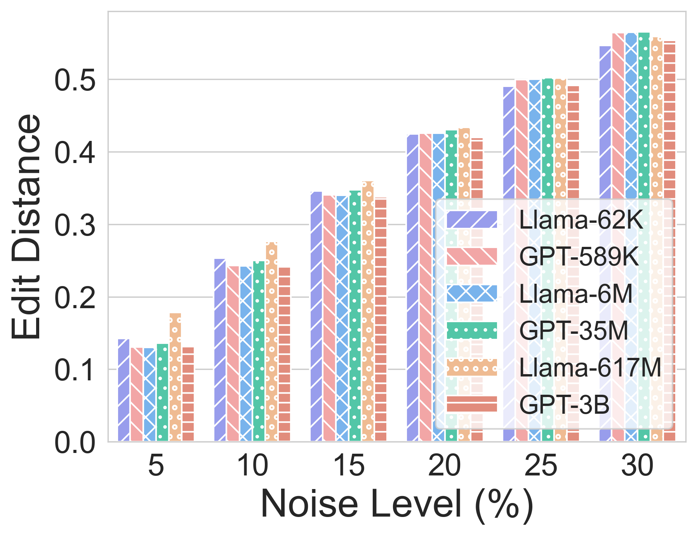
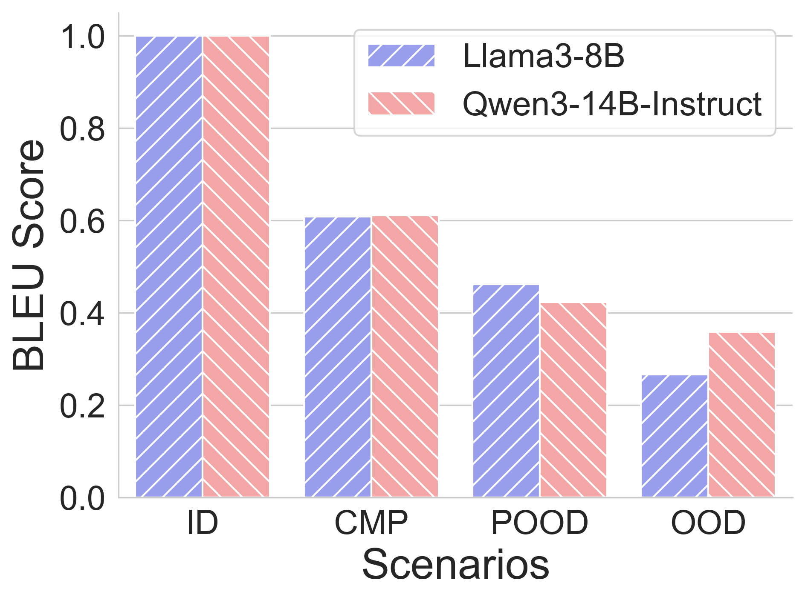
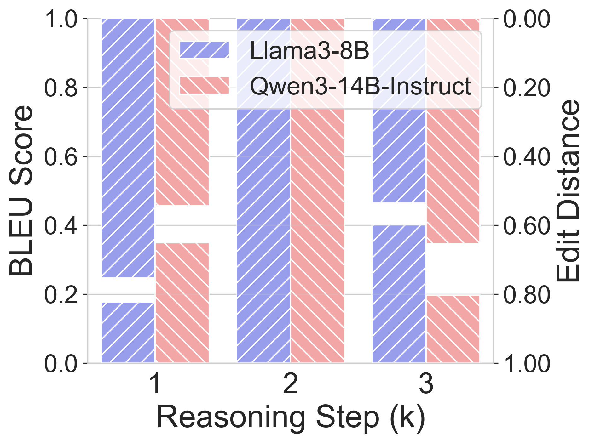
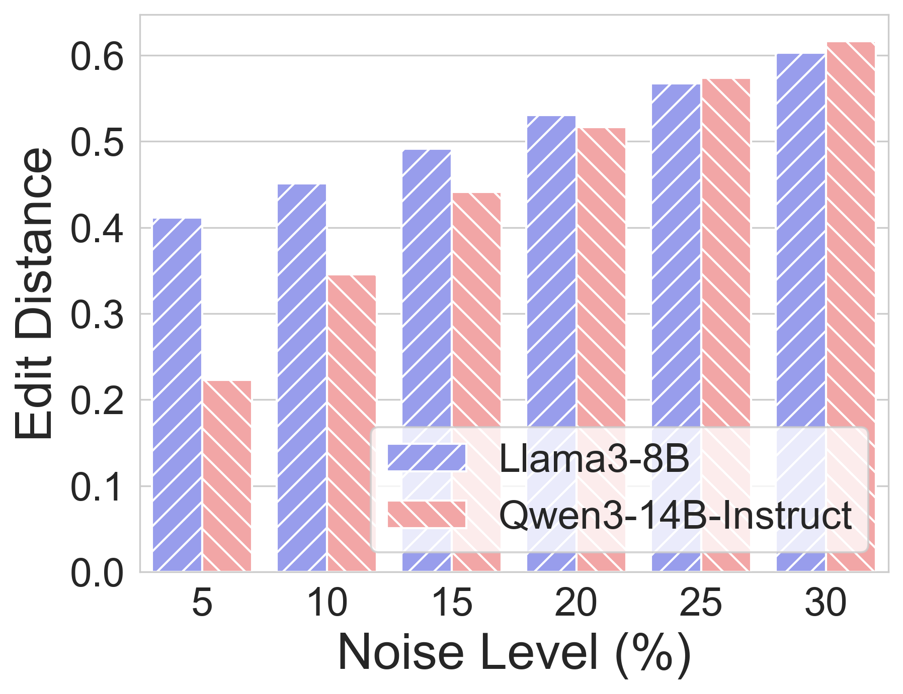

# Is Chain-of-Thought Reasoning of LLMs a Mirage? A Data Distribution Lens

[](http://arxiv.org/abs/2508.01191) [](http://arxiv.org/abs/2508.01191) [](https://huggingface.co/papers/2508.01191)

This repository contains the official Python implementation of the framework described in the paper **"Is Chain-of-Thought Reasoning of LLMs a Mirage? A Data Distribution Lens."**

## 📰 News

- **[04/18/2026]** Code release! **DataAlchemy** environment is now available in this repository.
- **[04/07/2026]** Our paper is accepted to **ACL 2026** (The 64th Annual Meeting of the Association for Computational Linguistics), San Diego, CA, USA, July 2-7, 2026. 🎉
- **[11/26/2025]** Our paper is accepted to the **NeurIPS 2025 Workshop on Foundations of Reasoning in Language Models (FoRLM)**, San Diego, CA, USA, Dec 2-7, 2025. Check the paper on [OpenReview](https://openreview.net/pdf?id=o2AoLPIjle).
- **[09/01/2025]** Our paper has been covered by **The New Yorker**, **SF Examiner**, **VentureBeat**, **Ars Technica**, **The Decoder**, **Slashdot**, **Unite.AI**, **WebProNews**, **Digital Watch Observatory**, and many other media outlets, blogs, newsletters, podcasts, and social platforms — see the full [media coverage list](docs/MEDIA_COVERAGE.md).
- **[08/07/2025]** Our paper achieves **#1 Paper of the day** at [Hugging Face](https://huggingface.co/papers/2508.01191). Appreciate the great interest! 🚀
- **[08/02/2025]** Paper avalible! The first version is available on [arXiv](http://arxiv.org/abs/2508.01191).
- **[08/01/2025]** GitHub repository created. Code release is coming soon.

## 🔭 Introduction

Chain-of-Thought (CoT) prompting has been shown to improve Large Language Model (LLM) performance on various tasks. With this approach, LLMs appear to produce human-like reasoning steps before providing answers (a.k.a., CoT reasoning), which often leads to the perception that they engage in deliberate inferential processes. However, some initial findings suggest that CoT reasoning may be more superficial than it appears, motivating us to explore further. In this paper, we study CoT reasoning via a data distribution lens and investigate if CoT reasoning reflects a structured inductive bias learned from in-distribution data, allowing the model to conditionally generate reasoning paths that approximate those seen during training. Thus, its effectiveness is fundamentally bounded by the degree of distribution discrepancy between the training data and the test queries. With this lens, we dissect CoT reasoning via three dimensions: **task**, **length**, and **format**. To investigate each dimension, we design **DataAlchemy**, an isolated and controlled environment to train LLMs from scratch and systematically probe them under various distribution conditions. Our results reveal that CoT reasoning is a brittle mirage that vanishes when it is pushed beyond training distributions. This work offers a deeper understanding of *why* and *when* CoT reasoning fails, emphasizing the ongoing challenge of achieving genuine and generalizable reasoning.

<p align="center">
  <br>
  <em>Figure 1:</em> The data distribution lens.
</p>


## ✨ Contribution

⭐ **Novel Perspective.** We propose a *data distribution lens* for CoT reasoning, revealing that its effectiveness arises from structured inductive biases learned from in-distribution data. This lens offers a principled foundation for understanding why and when CoT reasoning succeeds or fails.

⭐ **Controllable eEvironment.** We develop an abstract, fully controllable, and clean environment: **DataAlchemy** that abstracts NLP tasks, enabling systematic analysis of CoT reasoning under distribution discrepancies. DataAlchemy can serve as a research platform for probing the intrinsic behavior of LLMs and facilitating the discovery of scientific principles.

⭐ **Rigorous Investigation.** Guided by the data distribution lens, we dissect the CoT reasoning via three dimensions: *task*, *length*, and *format*. Later, we curate data that reflects fine-grained factors in each dimension and conduct controlled experiments to isolate and examine each factor.

⭐ **General validity.** We train and fine-tune hundreds of LLMs with varying sizes (from 62K to 14B), architectures (e.g., GPT, LLaMA, and Qwen), and temperatures (from 1e-5 to 10). The results consistently show that the effectiveness of CoT reasoning varies with the degree of distribution discrepancy, substantiating the generality of the proposed data distribution lens.

⭐ **Real-world implication.** This work reframes the understanding of contemporary LLMs' reasoning capabilities and emphasizes the risk of over-reliance on CoT reasoning as a universal problem-solving paradigm. It underscores the necessity for proper evaluation methods and the development of LLMs that possess authentic and generalizable reasoning capabilities.

<p align="center">
  <br>
  <em>Figure 2:</em> DataAlchemy framework.
</p>

## 🗂️ Repository Layout

```text
DataAlchemy/
│
├── configs/                     YAML configs (base defaults + per-experiment overrides)
│   ├── _base/                   shared pretrain / SFT defaults
│   ├── pretrain/                task, length, and format generalization
│   └── sft/                     task-level SFT
│
├── data/                        populated at runtime by scripts/generate_data.py
├── docs/                        supplementary docs (media coverage, etc.)
├── experiments/                 end-to-end launchers, one per YAML config
├── figure/                      paper figures referenced in this README
│
├── scripts/                     thin CLI entry points
│   ├── generate_data.py         build a dataset file from a transformation spec
│   ├── apply_noise.py           inject token-level noise into existing CoT files
│   ├── pretrain_model.py        train-from-scratch loop
│   ├── sft_model.py             supervised fine-tuning loop
│   ├── model_inference.py       batch inference (writes predictions.jsonl)
│   └── evaluate_predictions.py  score predictions into results.json (CPU only)
│
├── src/                         core package
│   ├── atoms.py                 26-letter atoms and elements
│   ├── constants.py             special tokens (<s>, <pad>, <think>, <answer>, [F1..F3])
│   ├── transformations.py       f_rot, f_pos, f_reverse, Composition, parsers
│   ├── models.py                GPT-2 / LLaMA factories trained from scratch
│   ├── inference.py             Inference class wrapping model.generate
│   ├── data/                    generator, splits, mixer, noise
│   ├── training/                pretrain, sft, HF TrainingArguments builder
│   ├── evaluation/              metrics (EM, edit distance, BLEU), evaluator, scoring
│   └── utils/                   config, CLI, logging, run_logging, seed
│
└── tests/                       pytest suite (fast logic + slow training integrations)

Generated at runtime:
    saves/     tokenizer and model checkpoints, one subdir per experiment
    logs/      per-run unified log files        (logs/<experiment>/run_<timestamp>.log)
    results/   evaluation metrics + predictions (results/<experiment>/<test_tag>/)
```

## 📦 Installation

The repo is managed with [uv](https://docs.astral.sh/uv/), an extremely fast Python
package and project manager written in Rust.

### With uv (recommended)

Clone the repository, then create an isolated `.venv/` with `uv`.

```console
$ git clone https://github.com/ChengshuaiZhao0/DataAlchemy.git
$ cd DataAlchemy
$ uv sync                         # create .venv and install runtime deps from uv.lock
$ uv sync --extra dev             # add the dev extras (pytest, pytest-cov, ruff)
$ uv run pytest                   # smoke-test the install (fast suite only)
$ uv run pytest -m slow           # also run the training integration tests
```

<details>
<summary>With pip (alternative)</summary>

If you prefer a plain `pip` workflow, a standard editable install also works. Note
that this path resolves against `pyproject.toml` rather than `uv.lock`, so minor
patch versions may differ from the ones used in the paper.

```console
$ python -m venv .venv && source .venv/bin/activate
$ pip install -e ".[dev]"
```

</details>

## 🚀 Quickstart

The standard DataAlchemy pipeline has four stages that run back-to-back:

1. **Generate data.** Build symbolic datasets from transformation specs with `scripts/generate_data.py` (and optionally `scripts/apply_noise.py`).
2. **Train.** Pretrain from scratch via `scripts/pretrain_model.py`, or supervised fine-tune via `scripts/sft_model.py`.
3. **Inference.** Batch-generate predictions on test scenarios with `scripts/model_inference.py`.
4. **Evaluate.** Score predictions into metrics with `scripts/evaluate_predictions.py`.

One end-to-end launcher chains all four stages in a single call:

```console
$ bash experiments/task_generalization.sh
```

When it finishes, aggregate metrics are in `results/task_generalization/<test_tag>/results.json`, per-sample predictions in `results/task_generalization/<test_tag>/predictions.jsonl`, and the full run log in `logs/task_generalization/run_<timestamp>.log`.

The sections below walk through each stage so you can run them individually or swap in your own configs. See [Experiments](#-experiments) for the full list of pre-wired launchers.

## 🧪 Stage 1 · Generate Data

The `data/` folder is empty by default; all datasets are generated on the fly from symbolic rules, so nothing is downloaded.

### Creating a dataset

One JSONL record per `(element, transformation-composition)` pair is written to `--output`.

A minimal two-step composition (`k=2`):

```console
$ python scripts/generate_data.py --transformations "[F1]" "[F2]" --element-length 4 --output data/F1F2.jsonl
```

The CLI exposes four knobs that map directly onto the paper's axes:

| Flag | Axis | Notes |
| --- | --- | --- |
| `--transformations` | reasoning steps `k` and primitive choice | space-separated tokens; each token adds one step (`[F1]`, `[F2]`, `[F3]`) |
| `--element-length` | text length `l` | atom count per element; default `4` |
| `--rot-n`, `--pos-n` | transformation parameters | default `13` for ROT, `1` for cyclic shift |
| `--no-cot`, `--downsample-to N` | format / size | drop reasoning trace, or subsample to `N` records |

<details>
<summary>More examples (k=1, k=3, length sweep, no-CoT, custom ROT/shift, subsampling)</summary>

```console
# Single-step primitives (k=1)
$ python scripts/generate_data.py --transformations "[F1]" --element-length 4 --output data/F1.jsonl
$ python scripts/generate_data.py --transformations "[F2]" --element-length 4 --output data/F2.jsonl
$ python scripts/generate_data.py --transformations "[F3]" --element-length 4 --output data/F3.jsonl

# Full task-generalization set (k=2): F1F1, F1F2, F2F1, F2F2
$ python scripts/generate_data.py --transformations "[F1]" "[F1]" --element-length 4 --output data/F1F1.jsonl
$ python scripts/generate_data.py --transformations "[F2]" "[F1]" --element-length 4 --output data/F2F1.jsonl
$ python scripts/generate_data.py --transformations "[F2]" "[F2]" --element-length 4 --output data/F2F2.jsonl

# Deeper reasoning (k=3)
$ python scripts/generate_data.py --transformations "[F1]" "[F2]" "[F1]" --element-length 4 --output data/F1F2F1.jsonl

# Length sweep: fix the composition, vary l
$ for L in 2 3 4 5 6; do
      python scripts/generate_data.py --transformations "[F1]" "[F2]" --element-length $L --output data/F1F2_len$L.jsonl
  done

# No-CoT variant: <answer> as the generation start, no <think> trace
$ python scripts/generate_data.py --transformations "[F1]" "[F2]" --element-length 4 --no-cot --output data/F1F2_nocot.jsonl

# Custom ROT shift and cyclic shift
$ python scripts/generate_data.py --transformations "[F1]" "[F2]" --element-length 4 --rot-n 7 --pos-n 2 --output data/F1F2_rot7_pos2.jsonl

# Subsampling: the full enumeration is 26^l per composition, so cap it for quick iteration
$ python scripts/generate_data.py --transformations "[F1]" "[F2]" --element-length 6 --downsample-to 100000 --output data/F1F2_len6_100k.jsonl
```

</details>

### Injecting noise

```console
$ python scripts/apply_noise.py --inputs data/F1F2.jsonl --output data/F1F2_hybrid_0p10.jsonl \
      --mode hybrid --p 0.10 --domain all --seed 42
```

| Flag | Values | Controls |
| --- | --- | --- |
| `--mode` | `insert` \| `delete` \| `modify` \| `hybrid` | noise operation applied to each selected token |
| `--domain` | `all` \| `element` \| `transformation` \| `instruction` | which part of the input the noise targets |
| `--p` | `0.0`–`1.0` | per-token corruption probability |
| `--seed` | int | RNG seed for reproducible noise |

### Dataset schema

Every generated dataset file is organized by JSON Lines. Each record bundles the fully rendered prompt (`input`) and target (`output`) with their constituent pieces (`element`, `transformation`, `instruction`, `reasoning`, `answer`), so downstream code can either train on the rendered strings directly or re-derive them from the components. The fields are:

| Field            | Type   | Meaning                                                                                |
|------------------|--------|----------------------------------------------------------------------------------------|
| `input`          | str    | What the LM conditions on: `element + " " + transformation + " " + instruction`.       |
| `output`         | str    | What the LM should produce: reasoning trace (if any) + `<answer>` + final element.     |
| `element`        | str    | Input element atoms.                                                                   |
| `transformation` | str    | Initial transformation tokens, space-joined.                                           |
| `instruction`    | str    | Output-start marker: `<think>` (CoT) or `<answer>` (no-CoT).                           |
| `reasoning`      | str    | Trace inside `output` before the final `<answer>`. Empty when no CoT.                  |
| `answer`         | str    | Final element after `<answer>`.                                                        |

> Invariants: `input == element + " " + transformation + " " + instruction`; the full rendered line is `input + " " + output`.

## 🏋️ Stage 2 · Train

Training is driven by YAML configs under [configs/pretrain/](configs/pretrain/) and [configs/sft/](configs/sft/). Pretraining builds a model from scratch; SFT fine-tunes an existing checkpoint on a small in-distribution slice. Any config key accepts a dotted CLI override, for example `--model.hidden_size=512 --train.lr=1e-3`.

### Pretrain from scratch

```console
$ python scripts/pretrain_model.py --config configs/pretrain/task_generalization.yaml
```

Outputs: tokenizer + model checkpoint under `cfg.checkpoint.model_dir` (e.g. `saves/task_generalization/model/final`). Key knobs (defaults from [configs/_base/pretrain.yaml](configs/_base/pretrain.yaml)):

| Config key | Default | Controls |
| --- | --- | --- |
| `model.arch` | `GPT` | architecture: `GPT` or `Llama` |
| `model.hidden_size` / `n_layer` / `n_head` | `32` / `4` / `4` | transformer width and depth |
| `model.n_positions` | `256` | max sequence length |
| `model.attn_implementation` | `sdpa` | `sdpa` \| `eager` \| `flash_attention_2` |
| `train.num_epochs` | `10` | training epochs |
| `train.per_device_batch_size` | `1024` | per-GPU batch size |
| `train.lr` / `lr_scheduler_type` / `warmup_ratio` | `3e-3` / `cosine` / `0.1` | optimizer and schedule |
| `train.bf16` | `true` | bf16 mixed-precision training |
| `train.validation_ratio` | `0` | fraction held out for eval (0 = no eval split) |
| `dataset.train` | *(required)* | comma-separated JSONL paths |
| `system.seed` | `42` | RNG seed (torch / numpy / random) |

<details>
<summary>Supervised fine-tuning</summary>

SFT starts from a pretrained checkpoint and fine-tunes on a small in-distribution dataset. Make sure `cfg.checkpoint.pretrained_model_dir` exists before running:

```console
$ python scripts/sft_model.py --config configs/sft/task_sft.yaml
```

Additional SFT-specific keys (defaults from [configs/_base/sft.yaml](configs/_base/sft.yaml)):

| Config key | Default | Controls |
| --- | --- | --- |
| `checkpoint.pretrained_model_dir` | *(required)* | path to the pretrained checkpoint to fine-tune |
| `checkpoint.tokenizer_dir` | *(required)* | tokenizer from the pretraining run (reused, not rebuilt) |
| `dataset.train_ratio` | `1.0` | fraction of `dataset.train` used for fine-tuning (e.g. `0.0001` for 1%) |
| `train.num_epochs` | `20000` | many epochs on a small slice |
| `train.per_device_batch_size` | `256` | smaller than pretrain |
| `train.lr` | `5e-3` | SFT default |

</details>

## 🔮 Stage 3 · Inference

Load the trained checkpoint and batch-generate predictions on every test tag listed in `cfg.dataset.test`:

```console
$ python scripts/model_inference.py --config configs/pretrain/task_generalization.yaml
```

Outputs: one `predictions.jsonl` per test tag at `results/<experiment>/<test_tag>/predictions.jsonl`. Key knobs:

| Config key / flag | Default | Controls |
| --- | --- | --- |
| `inference.per_device_batch_size` | `51200` | generations per forward pass; the primary throughput knob |
| `inference.do_sample` | `false` | `true` enables sampling; otherwise greedy decoding |
| `inference.temperature` | `1.0` | sampling temperature (only used when `do_sample: true`) |
| `inference.top_k` | `50` | top-k sampling cutoff |
| `inference.top_p` | `1.0` | nucleus (top-p) sampling cutoff |
| `dataset.test` | *(required)* | list of JSONL paths; each entry becomes one `<test_tag>` dir |
| `dataset.test_ratio` | `1.0` | fraction of each test file to evaluate |
| `--checkpoint` (CLI) | `cfg.checkpoint.model_dir` | override which checkpoint to load |

## 📊 Stage 4 · Evaluate

Score predictions into metrics. This step is **CPU-only and re-scorable offline**, so you can re-run it without touching the model:

```console
$ python scripts/evaluate_predictions.py --config configs/pretrain/task_generalization.yaml
```

Outputs: `results/<experiment>/<test_tag>/results.json` with exact-match accuracy, average edit distance, and average BLEU (see [src/evaluation/metrics.py](src/evaluation/metrics.py)). A combined summary is appended to the run log footer.

| Config key | Default | Controls |
| --- | --- | --- |
| `evaluate.split_reasoning` | `true` | when `true`, score reasoning trace and final answer separately |
| `evaluate.num_workers` | `8` | CPU workers for scoring (`0` = `min(8, cpu_count())`; `1` = single-process) |
| `dataset.test` | *(required)* | same test spec as Stage 3; each tag expects a matching `predictions.jsonl` |

## 🧬 Experiments

Each launcher chains the four stages above end-to-end, tees full stdout/stderr into `logs/<experiment>/run_<timestamp>.log`, and prints the result directory at the end.

| Launcher | Description |
| --- | --- |
| [experiments/task_generalization.sh](experiments/task_generalization.sh) | Task generalization: pretrain on compositions `F1∘F1`, `F1∘F2`, `F2∘F1` and evaluate on the held-out composition `F2∘F2`. |
| [experiments/length_generalization.sh](experiments/length_generalization.sh) | Length generalization: pretrain at element length `l=4` and evaluate at unseen lengths `l=2` and `l=3`. |
| [experiments/format_generalization.sh](experiments/format_generalization.sh) | Format generalization: pretrain on clean `F1` / `F2` and evaluate under hybrid token-level noise at `p=0.10` and `p=0.20`. |
| [experiments/task_sft.sh](experiments/task_sft.sh) | SFT recovery: fine-tune the task-gen checkpoint on a small slice of `F2∘F2` to probe how little in-distribution data restores OOD performance. |


## 🖥️ Hardware & Runtime

Stage-by-stage wall-clock on a single **NVIDIA A100-SXM4-40GB**:

| Experiment | Generate | Train | Inference | Evaluate | **Total** |
| --- | ---: | ---: | ---: | ---: | ---: |
| [task_generalization.sh](experiments/task_generalization.sh) | ~1m | ~11m | ~3m | ~10s | **~15m** |
| [length_generalization.sh](experiments/length_generalization.sh) | ~1m | ~5m | ~10s | ~1s | **~6m** |
| [format_generalization.sh](experiments/format_generalization.sh) | ~2m | ~5m | ~50m | ~20s | **~60m** |
| [task_sft.sh](experiments/task_sft.sh) | ~30s | ~5m | ~3m | ~10s | **~10m** |

## 📈 Additional Results

We probe the generality of the data distribution lens along two axes: 
- *Internal validity*: GPT and LLaMA models trained from scratch (62K to 3B) all show the same degradation under task, length, and format shifts.
- *External validity*: fine-tuning SOTA LLMs (LLaMA3-8B, Qwen3-14B-Instruct) reproduces the same trends.

<table>
  <tr>
    <th><div align="center">Task generalization</div></th>
    <th><div align="center">Length generalization</div></th>
    <th><div align="center">Format generalization</div></th>
  </tr>
  <tr>
    <td></td>
    <td></td>
    <td></td>
  </tr>
  <tr><td colspan="3" align="center"><em>Figure A1: Internal validity. GPT/LLaMA models trained from scratch (62K to 3B) exhibit the same degradation profile across all three axes.</em></td></tr>
  <tr>
    <td></td>
    <td></td>
    <td></td>
  </tr>
  <tr><td colspan="3" align="center"><em>Figure A2: External validity. Fine-tuning SOTA LLMs reproduces the same degradation under task, length, and format shifts.</em></td></tr>
</table>

---

## 📝 Citation

If our repo helped you out, we'd love it if you gave us a citation! Thanks for supporting our work!

```tex
@article{zhao2025chain,
  title={Is Chain-of-Thought Reasoning of LLMs a Mirage? A Data Distribution Lens},
  author={Zhao, Chengshuai and Tan, Zhen and Ma, Pingchuan and Li, Dawei and Jiang, Bohan and Wang, Yancheng and Yang, Yingzhen and Liu, Huan},
  journal={arXiv preprint arXiv:2508.01191},
  year={2025}
}
```
