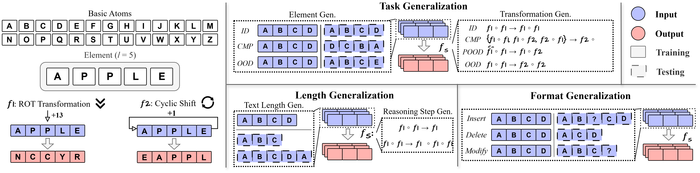

# Is Chain-of-Thought Reasoning of LLMs a Mirage? A Data Distribution Lens

 

This repository contains the official Python implementation of the framework described in the paper **"Is Chain-of-Thought Reasoning of LLMs a Mirage? A Data Distribution Lens."**

## News

- **[08/01/2025]** GitHub repository created. Code release is coming soon.

## Introduction

Chain-of-Thought (CoT) prompting has been shown to improve Large Language Model (LLM) performance on various tasks. With this approach, LLMs appear to produce human-like reasoning steps before providing answers (a.k.a., CoT reasoning), which often leads to the perception that they engage in deliberate inferential processes. However, some initial findings suggest that CoT reasoning may be more superficial than it appears, motivating us to explore further. In this paper, we study CoT reasoning via a data distribution lens and investigate if CoT reasoning reflects a structured inductive bias learned from in-distribution data, allowing the model to conditionally generate reasoning paths that approximate those seen during training. Thus, its effectiveness is fundamentally bounded by the degree of distribution discrepancy between the training data and the test queries. With this lens, we dissect CoT reasoning via three dimensions: **task**, **length**, and **format**. To investigate each dimension, we design **DataAlchemy**, an isolated and controlled environment to train LLMs from scratch and systematically probe them under various distribution conditions. Our results reveal that CoT reasoning is a brittle mirage that vanishes when it is pushed beyond training distributions. This work offers a deeper understanding of *why* and *when* CoT reasoning fails, emphasizing the ongoing challenge of achieving genuine and generalizable reasoning. 

## Contribution

⭐ **Novel perspective.** We propose a data distribution lens for CoT reasoning, illuminating that its effectiveness stems from structured inductive biases learned from in-distribution training data. This framework provides a principled lens for understanding *why* and *when* CoT reasoning succeeds or fails.

⭐ **Controlled environment.** We introduce DataAlchemy an isolated experimental framework that enables training LLMs from scratch and systematically probing CoT reasoning. This controlled setting allows us to isolate and analyze the effects of distribution shifts on CoT reasoning without interference from complex patterns learned during large-scale pre-training.

⭐ **Empirical validation.** We conduct systematic empirical validation across three critical dimensions—*task*, *length*, and *format*. Our experiments demonstrate that CoT reasoning exhibits sharp performance degradation under distribution shifts, revealing that seemingly coherent reasoning masks shallow pattern replication.

⭐ **Real-world implication.** This work reframes the understanding of contemporary LLMs' reasoning capabilities and emphasizes the risk of over-reliance on CoT reasoning as a universal problem-solving paradigm. It underscores the necessity for proper evaluation methods and the development of LLMs that possess authentic and generalizable reasoning capabilities.